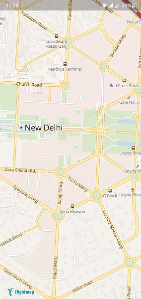
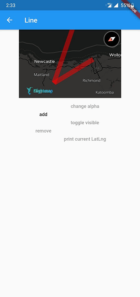
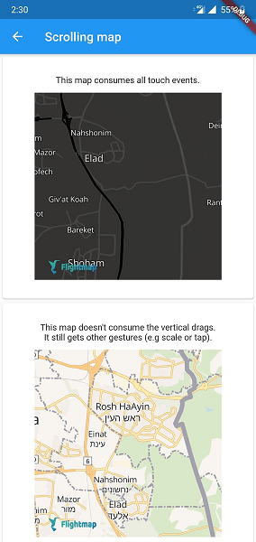

# Flutter FlightMap GL

> **Please note that this project is community driven and is an official FlightMap product.** 

This Flutter plugin allows to show embedded interactive and customizable vector maps inside a Flutter widget. For the Android and iOS integration, we use [flightmap-gl-native](https://app.flightmap.io/v2/).

 


 


## Running the example app

- Install [Flutter](https://flutter.io/get-started/) and validate its installation with `flutter doctor`
- Clone the repository with `git clone https://github.com/Jungle-Works/flutter-flightmap-sdk`
- Add a FlightMap access token to the example app (see next section)
- Connect a mobile device or start an emulator, simulator or chrome
- Locate the id of a the device wi
th `flutter devices`
- Run the app with `cd flutter_flightmap/example && flutter packages get && flutter run -d {device_id}`

## Adding a FlightMap Access Token

This project uses FlightMap vector tiles, which requires a FlightMap account and a FlightMap access token. Obtain a an access token on [your FlightMap account page](https://app.flightmap.io/v2/hud/api_keys).
> **Even if you do not use FlightMap vector tiles but vector tiles from a different source (like self-hosted tiles) with this plugin, you will need to specify any non-empty string as Access Token as explained below!**


The **recommended** way to provide your access token is through the `FlightMap` constructor's `accessToken` parameter. Note that you should always use the same token throughout your entire app.

## Using the SDK in your project

This project is available on [pub.dev](https://pub.dev/packages/flightmap_gl), follow the [instructions](https://flutter.dev/docs/development/packages-and-plugins/using-packages#adding-a-package-dependency-to-an-app) to integrate a package into your flutter application. For platform specific integration, use the flutter application under the example folder as reference. 

## Supported API

| Feature | Android | iOS | Web |
| ------ | ------ | ----- | ----- |
| Style | :white_check_mark:   | :white_check_mark: | :white_check_mark: |
| Camera | :white_check_mark:   | :white_check_mark: | :white_check_mark: |
| Gesture | :white_check_mark:   | :white_check_mark: | :white_check_mark: |
| User Location | :white_check_mark: | :white_check_mark: | :white_check_mark: |
| Symbol | :white_check_mark:   | :white_check_mark: | :white_check_mark: |
| Circle | :white_check_mark:   | :white_check_mark: | :white_check_mark: |
| Line | :white_check_mark:   | :white_check_mark: | :white_check_mark: |
| Fill |   |  |  |

## Map Styles

Map styles can be supplied by setting the `styleString` in the `MapOptions`. The following formats are supported:

1. Passing the URL of the map style. This can be one of the built-in map styles, also see `FlightMapStyles` or a custom map style served remotely using a URL that start with 'http(s)://'
2. Passing the style as a local asset. Create a JSON file in the `assets` and add a reference in `pubspec.yml`. Set the style string to the relative path for this asset in order to load it into the map.
3. Passing the raw JSON of the map style. This is only supported on Android.  


## Location features
To enable location features in an **Android** application:

You need to declare the `ACCESS_COARSE_LOCATION` or `ACCESS_FINE_LOCATION` permission in the AndroidManifest.xml and starting from Android API level 23 also request it at runtime. The plugin does not handle this for you. The example app uses the flutter ['location' plugin](https://pub.dev/packages/location) for this. 

To enable location features in an **iOS** application:

If you access your users' location, you should also add the following key to your Info.plist to explain why you need access to their location data:

```xml
<key>NSLocationWhenInUseUsageDescription</key>
<string>[Your explanation here]</string>
```

FlightMap [recommends](https://docs.FlightMap.com/help/tutorials/first-steps-ios-sdk/#display-the-users-location) the explanation "Shows your location on the map and helps improve the map".

## Getting Help

- **Need help with your code?**: Look for previous questions on the [#FlightMap tag]https://github.com/Jungle-Works/flutter-flightmap-sdk) — or [ask a new question](https://github.com/Jungle-Works/flutter-flightmap-sdk).
- **Have a bug to report?** [Open an issue](https://github.com/Jungle-Works/flutter-flightmap-sdk). If possible, include a full log and information which shows the issue.
- **Have a feature request?** [Open an issue](https://github.com/Jungle-Works/flutter-flightmap-sdk). Tell us what the feature should do and why you want the feature.


